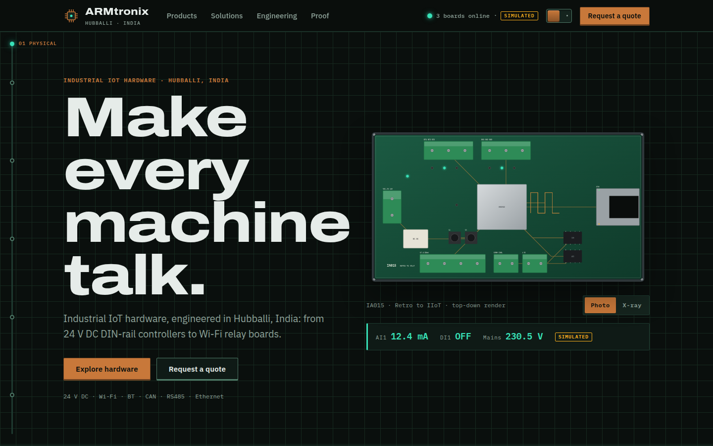
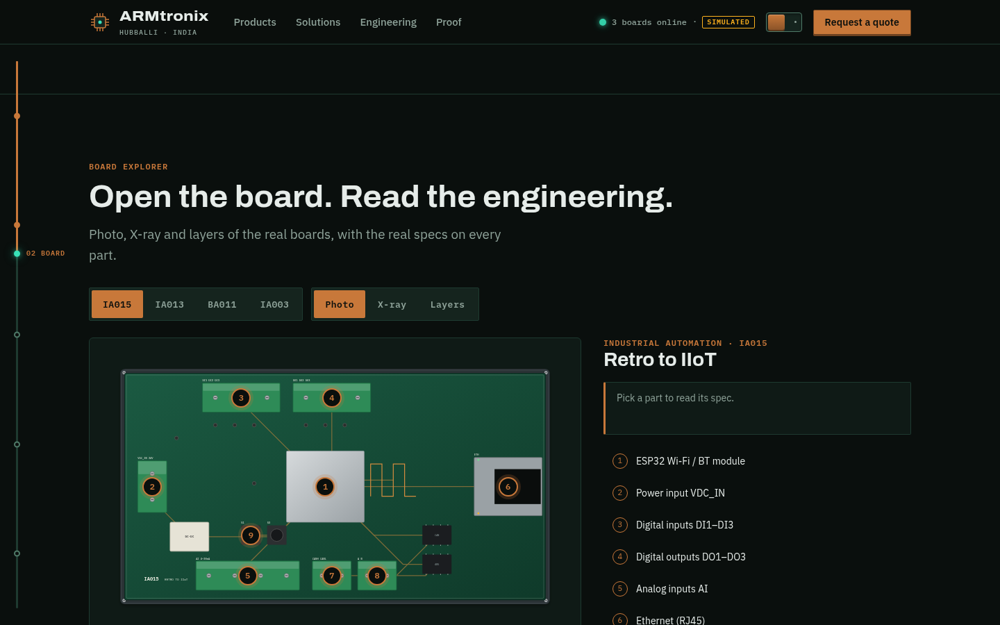
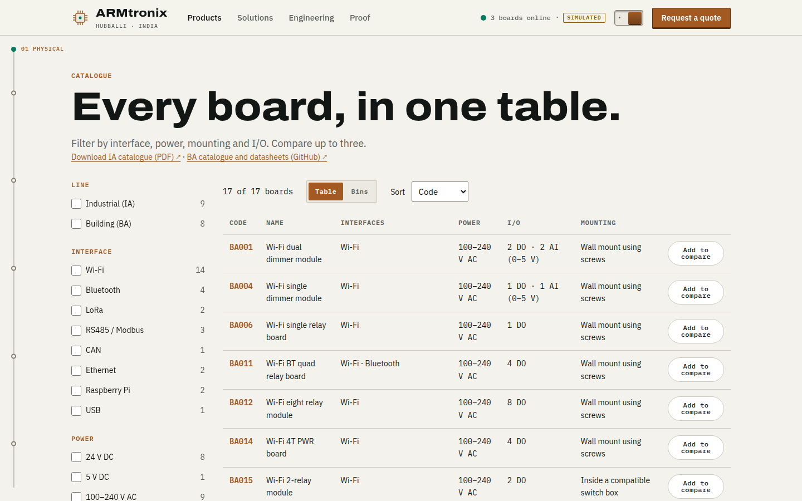
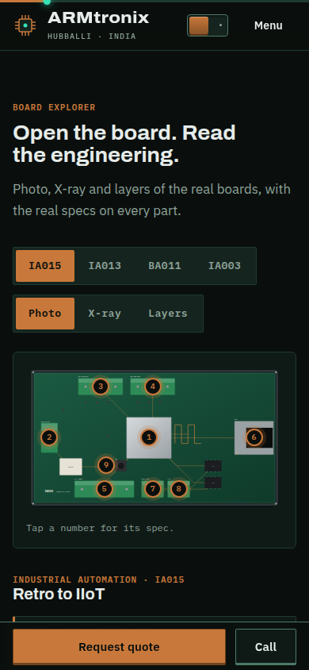

# ARMtronix · Design and strategy rationale (ARM-23)

**Concept: Make every machine talk.** A site for ARMtronix, the Industrial IoT hardware maker in Hubballi, India, built around one idea: their boards give silent machines a voice, and the site lets a visitor hear it.

## 1. Brand strategy

**The idea comes from the product, not a mood board.** ARMtronix's signature board is literally called *Retro to IIoT* (IA015): a DIN-rail box that gives existing Siemens and Beckhoff PLCs Wi-Fi, CAN, RS485 and Ethernet. That is the brand in one sentence: they make old machines speak. "Make every machine talk" says it in the customer's terms, and every section of the site is a step in that conversation.

**The signal path is the motif.** A single copper trace runs down the left edge of the site (along the top on phones), the way a trace runs across a PCB. It is the scroll progress bar, the section connector and the storyline at once: *Physical → Board → Protocol → Cloud → Decision*. Data packets ride it, and moments on the page (flipping a relay, finishing an RFQ step) fire a pulse down it. One motif explains what IIoT is without a word of jargon.

**Colour with a job.**
- *Copper* is the brand and the primary action colour, because copper literally carries the signal on a board.
- *Signal green* is reserved for live data only (values, "online", packets), so green always means "this is data".
- *Amber* is for warnings and the "Simulated" tag; *red* appears only for faults and the e-stop.
- *Solder-mask black-green* and *datasheet paper* are the two grounds.

**Type.** Archivo's expanded widths read as stencilled and engineered, right for headlines. IBM Plex Sans has an engineering heritage and stays legible in dense specs. IBM Plex Mono is the datasheet's voice: part codes, pin labels, telemetry and MQTT lines. Three families, each with one job.

**Two themes, two readers.** *Control Room* (dark) is how an engineer sees a panel at night. *Datasheet* (light) is how a buyer reads a spec sheet. The first visit follows the visitor's OS. The toggle is drawn as a physical toggle switch, and the new theme spreads out from the switch.

**Our own board renders instead of stock photos.** No free photos of ARMtronix boards exist, and stock "circuit" imagery would make them look like everyone else. So every hero board is drawn as layered SVG from the datasheets, in three lenses: Photo, X-ray and Layers. That makes the hardware the hero and keeps it addressable: hotspots, LEDs and layers are real elements the site can light up.

## 2. UX and motion

Four signature interactions, each tied to a buyer behaviour:

| Interaction | What it proves | Behaviour it drives | Accessibility and reduced motion |
|---|---|---|---|
| **Board explorer** (H3, product pages) | The *physical* engineering: real parts, real specs on every part | Engineers self-serve specs, then open the datasheet page | Hotspots are buttons with a numbered list twin; lens tabs work with arrow keys; reduced motion swaps lenses instantly |
| **Live telemetry console** (H4) | The *digital* half: the hardware produces data | Plant managers see their own use case and click "Monitor my own machines" | Gauge, LEDs and switches have text equivalents; MQTT lines are announced politely and throttled; the engine pauses off-screen |
| **Signal path** (H2) | How IIoT works, in five steps | Non-technical buyers understand the offer before the specs | Pinned only at ≥ 1024 px; reduced motion and phones get a plain list |
| **RFQ wizard** (H9, overlay, /rfq) | That buying is easy | Qualified quote requests instead of cold emails | Native modal dialog (focus trap, Esc), inline errors linked to fields, the draft is kept on the device |

Motion follows one rule: precise easing, 150–400 ms for UI and up to 800 ms for storytelling, and nothing bounces except physical things (the gauge needle, the relay levers). Every animation has a reduced-motion path, and the boot log is skipped entirely.

**Honest telemetry.** Every live value carries a visible *Simulated* tag. The engine is seeded and deterministic, runs at 1 Hz, makes no network calls, and stops when it isn't on screen. A credible industrial brand cannot fake a live feed, so the site says it is a simulation and still lets the visitor touch it.

## 3. Client pitch value

1. **Qualified RFQs instead of cold emails.** A five-step wizard captures role, need, product codes, interfaces, I/O, power, volume and timeline before sales replies. Every CTA pre-fills it with the product and the intent.
2. **Engineers serve themselves.** Seventeen boards in one filterable engineering table, a datasheet page per board, hotspot specs and copyable MQTT snippets answer the first five questions without a call.
3. **"Made in Hubballi" as an export story.** The site presents an Indian hardware maker with the precision of a datasheet, which is what an overseas OEM or integrator needs to see before trusting a supplier.
4. **OEM and custom-design leads.** The "From schematic to shipment" section and its RFQ path turn the engineering team itself into a product.
5. **Credibility from the open.** Public GitHub repos, the Tasmota listing, a 2016 CNX Software article and third-party reviews are shown with source and date, not as unverifiable claims.
6. **A reusable product-data system.** Every spec on the site is generated from one typed file (`PRODUCTS.json`). Adding a board updates the drawer, the catalogue, the compare view and its own page.

## Anti-template

This is deliberately not a SaaS landing page. There are no floating-gradient blobs, no pricing tiers and no feature-tick tables. Specs appear as engineering datasheet tables with units. Hardware is on screen in every section, as a render, a schematic, a component or a terminal. A buyer of 24 V DIN-rail controllers decides on pinouts and protocols, so those are what the design puts first.

## Entity note and open questions

The brief links armtronix.com, which now belongs to a different, Malaysian infrastructure business. We designed for the Indian IIoT hardware maker the brief describes (ARMtronix Technologies LLP, Hubballi), whose catalogues and GitHub match it, and used no content from armtronix.com.

Open questions for the client:
- Are the address, phone numbers and emails from the 2021 catalogues still current? They are marked `[VERIFY]` on the site.
- Which boards are available today, and at what lead times?
- IA015 analog inputs: the catalogue says 4, the datasheet pin table shows 3.
- Can the Tindie order count (504) be confirmed and shown?
- Would ARMtronix supply real board photos for a future Photo lens?

